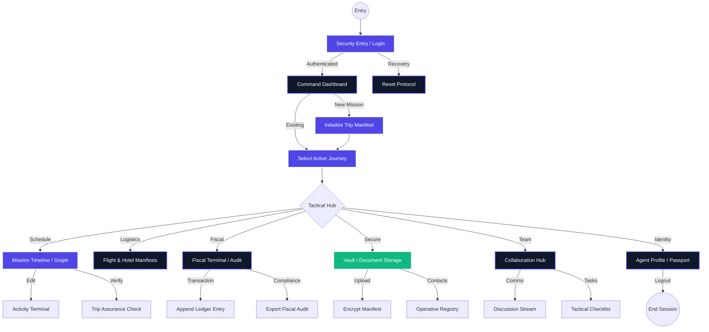
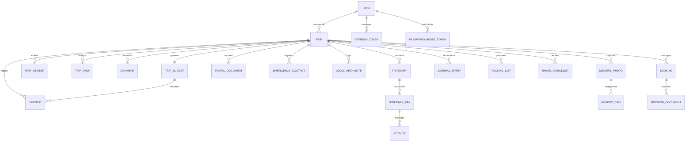

# Voyager Pro: Tactical User Flow & Architectural Journey

This document outlines the high-fidelity user journey through the **Voyager Pro** enterprise ecosystem. The flow is designed for maximum tactical efficiency, adhering to the "Horizon Glass" aesthetic and mission-critical logic.

## 1. Visual Ecosystem Overview

---

## 2. Global Mission Flow (Mermaid)

---

## 3. Tactical Flow Breakdowns

### 🟢 Phase A: Security Entry & Initialization
1.  **Operative Authentication**: Multi-layered login with cinematic glassmorphism.
2.  **Mission Selection**: Dashboard serves as the central command, displaying active manifests and quick-action triggers.

### 🔵 Phase B: Strategic Planning (Timeline)
1.  **Chronological Mapping**: Toggle between standard **Timeline** and high-density **24h Intelligence Grid**.
2.  **Activity Terminal**: Create tactical experiences with precise timing, cost, and location metadata.
3.  **Reschedule Protocol**: Drag-and-drop vertical synchronization for real-time mission adjustment.

### 🟡 Phase C: Fiscal & Logistical Hardening
1.  **Treasury Management**: Track expenses against budgeted allocation with real-time visualization.
2.  **Audit Compliance**: One-click generation of the **Fiscal Audit Manifest** (CSV) for corporate reconciliation.
3.  **Identity Vault**: Secure storage for Passports, Visas, and Emergency Operative contacts.

### 🔴 Phase D: Team Coordination
1.  **Secure Uplink**: Encrypted team discussion stream for intra-mission updates.
2.  **Tactical Objectives**: Kanban-style checklist to track mission completion status.

---

## 4. UI/UX Interaction Principles
- **Cinematic Transitions**: Every state change (Tab switch, Modal open) uses 300ms-500ms easing for a premium feel.
- **Horizon Glass Aesthetic**: Deep navy gradients (`bg-slate-900/95`) combined with vibrant indigo accents.
- **Tactical Information Density**: High-density data tables and graphs designed for professional operatives.

---

## 5. Data Architecture & Entity Mapping

The Voyager Pro ecosystem is built on a robust relational schema designed for mission-critical data integrity and high-performance tactical retrieval.

### 5.1 Entity Relationship Diagram (Mermaid)

### 5.2 Tactical Data Mapping

| Module | Primary Entity | Key Relationships | Data Integrity Notes |
|:---|:---|:---|:---|
| **Identity** | `User` | Trips, Security Tokens | Encrypted hash storage; JSON-serialized passport/preferences. |
| **Command** | `Trip` | Itinerary, Members, Budget | Root manifest for all tactical modules; governs RBAC scope. |
| **Schedule** | `Itinerary` | Days -> Activities | Chronological nesting with precise timezone and tag metadata. |
| **Fiscal** | `TripBudget` | Expenses, Splits | Real-time calculation of total vs. actual; category-based mapping. |
| **Vault** | `TravelDocument` | Trip, Bookings | Secure ingestion of binary assets and encrypted contact registry. |
| **Intelligence**| `LocalInfoNote` | Trip | Categorized destination insights (Customs, Logistics, etc.). |
| **Collab** | `Comment`, `Task` | Trip, Member | Event-driven discussion stream; priority-based objective tracking. |
| **Memories** | `MemoryPhoto` | Trip, Tags | High-fidelity asset management with geographic and tactical tagging. |

---
**Status**: Verified for Enterprise Presentation
**Data Layer**: EF Core 10 / SQL Server
**Serialization**: System.Text.Json (Polymorphic support for dynamic preferences)
